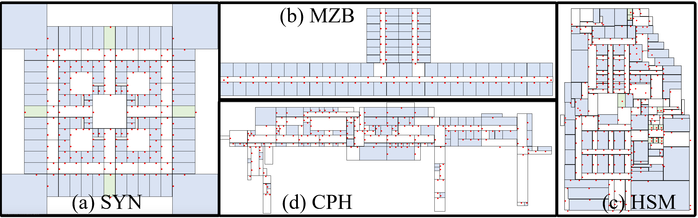

### Introduction

This is the code of a paper entitled "An Experimental Analysis of Indoor Spatial Queries: Modeling, Indexing, and Processing".

The work refers to an extensive experimental evaluation of five indoor space 
model/indexes that support four typical indoor spatial queries, 
namely range query (RQ), k nearest neighbor query (kNNQ), shortest path query (SPQ), and shortest distance query (SDQ). 
Our evaluation concerns the costs in model/index construction and query processing using a model/index. 

The five indoor space model/indexes are:
- indoor distance-aware model (IDModel)
- indoor distance-aware index (IDIndex)
- composite indoor index (CIndex)
- indoor partitioning tree (IP-tree)
- vivid IP-tree (VIP-tree)

### Datasets

[Synthetic Building (SYN)](https://deviantart.com/mjponso/art/Floor-Plan-for-a-Shopping-Mall-86396406) is a n-floor building. 
Its each floor is from a real-world floorplan of 1368m \* 1368m with 141 partitions and 216 doors. 
Its each two adjacent floors are connected by four 20m long stairways.
By default, we set n=5 and get the default dataset SYN5.

[Menzies Building (MZB)](https://www.monash.edu/virtual-tours/menzies-building) is a landmark building at Clayton campus of Monash University.
Each floor takes approximately 125m \* 35m and connects to adjacent floors by two or four stairways each being 5m long.
In total, there are 1344 partitions (including 34 staircases and 85 hallways) and 1375 doors.

[Hangzhou Shopping Mall (HSM)]() is a 7-floor mall in Hangzhou, China, occupying 2700m \* 2000m.
Ten stairways connect each two adjacent floors. Each floor contains 150 partitions and 299 doors on average. 
In total, there are 1050 partitions (including 70 staircases and 133 hallways) and 2093 doors.

[Copenhagen Airport (CPH)](https://www.cph.dk/en/practical) refers to the ground floor of Copenhagen Airport, taking around 2000m \* 600m with 147 partitions (including 25 hallways) and 211 doors.

SYN is generated by code, while MZB, HSM, and CPH are serializable files in the path `/inputfiles/`.

We provided a toolkit to visualize the floorplans of the datasets.
The sketches are shown as below.

### Query instance
Query instances for different datasets and query types could be seen in File Resource.

### Objects
The objects information for different datasets could also be found in File Resource.

### Code structure

- dk.aau.cs.indoorqueries
    - common (core libraries)
        - algorithm (implementations of RQ, kNNQ, SPDQ using different model/indexes)
        - iDMatrix (IDIndex implementation)
        - iDModel (IDModel implementation)
        - indoorEntity (indoor entity modeling)
        - iPTree (IPTree and VIPTree)
        - rStarTree2D (CIndex libraries)
        - rStarTree3D (CIndex libraries)
        - utilities
    - cph (evaluation on CPH dataset)
        - datagenerate (data loading and preprocessing)
        - test (model and algorithm tests and experimental evaluations)
    - hsm (evaluation on HSM dataset)
        - datagenerate
        - test
    - mzb (evaluation on MZB dataset)
        - datagenerate
        - test
    - syn (evaluation on SYN dataset)
        - datagenerate
        - test
- com.github.davidmoten (CIndex utilities)
- edu.princeton.cs.algs4 (utility libraries)

Other dependencies can be found in the `pom.xml` file.

### How to run the code

1. Select the corresponding java package of one dataset (SYN, MZB, HSM, or CPH); 
2. To load the indoor model, execute `datagenerate/dataGen` for SYN or `datagenerate/MZBdataGenRead` (`HSMdataGenRead`, or `CPHdataGenRead`) for the other three;
3. To test the model/indexes, execute `test/modelTest/IDMatrixTest` (or other model/indexes' test files)
4. To test different query algorithms based on different model/indexes, execute the java class under `test/algoTest/`
    - E.g., IDModelRQTest means Range Queries with IDModel.
5. To reproduce the experiments, execute the java class under test/experiments. 
    - There are 3 main java files, SPQ.java, RQ.java, and KNNQ.java corresponding to different queries. 
    - The main java files will call the `dataGen` (for data generation) and `objectGen` (for object generation) automatically. Note that the generation procedure will only run when generated data does not exist.
    - DatasetProperty.java refers to the statistics of the dataset.
    - Prepare.java refers to the generation of workloads.
    - The parameter tuning can be found in our experimental paper.

### Contact

1. [Tiantian Liu](https://vbn.aau.dk/en/persons/145323) (liutt@cs.aau.dk)
2. [Huan Li](http://people.cs.aau.dk/~lihuan/) (lihuan@cs.aau.dk)
3. [Hua Lu](http://luhua.ruc.dk) (luhua@ruc.dk)

Please feel free to contact us if any issues. You are also welcome to open an issue through GitHub.
We will continue to maintain this project.

### Acknowledgement

This work is supported by IRFD (No. 8022-00366B) and ARC (No. FT180100140 and DP180103411).
The authors would like to thank Zijin Feng for providing the relevant code.

### Citation

You are welcome to use our code and datasets for research use, but please do not forget to cite our paper :).

Tiantian Liu, Huan Li, Hua Lu, Muhammad Aamir Cheema, and Lidan Shou. Indoor Spatial Queries: Modeling, Indexing, and Processing. EDBT, 2021.
